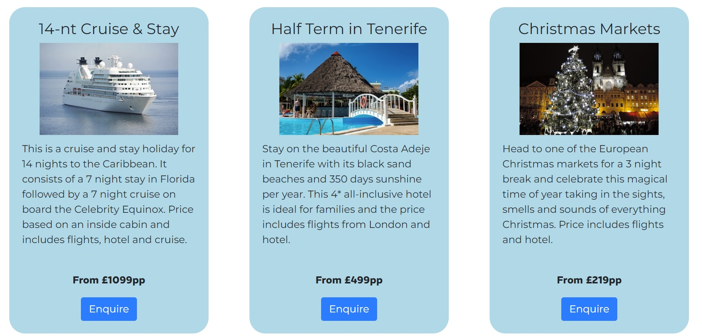

# Stuart Shimmin-Vincent - Personal Travel Agent Website

## Live project
[View the live project.](https://cshimvin.github.io/stuarts-travel-ms1/)
## Table of Contents
1. [Project Goals](#project-goals)
- Business Goals
- User Goals
2. [User Experience](#user-experience)
- User Stories
- Design and Structure
- Wireframes
3. [Features](#features)
- Must Have (current features)
- Could Have
- Won't Have (for now)
4. [Technologies Used](#technologies-used)
- Languages
- Frameworks
5. [Testing](#testing)
- HTML Validation
- CSS Validation
- Accessibility
- Performance
- Browser Compatibility
- Device Compatibility
- Testing User Stories
6. [Bugs](#bugs)
7. [Deployment](#deployment)
8. [Credits](#credits)

## Project Goals

### Business Goals

As a business, I would like the website to:
- be an online presence for the business
- to showcase what services the business offers
- be easy to navigate so visitors can find out about the company and what it offers
- to show the latest holiday offers to visitors
- to enable visitors to contact the business with any queries

### Visitor Goals

As a visitor, I would like the website to:
- be easy to navigate
- be easy to understand
- be able to view the website on a variety of devices

## User Experience

### User Stories
- First time visitor goals
    - As a first time visitor, I would like to easily found out about the company and the purpose of the site.
    - As a first time visitor, I want to be able to easily navigate the site and its content.
    - As a first time visitor, I want to be able to contact the business with any queries I have.
    - As a first time visitor, I want to be able to see what holidays are on offer.

- Returning visitor goals
    - As a returning visitor, I would like to navigate the site to find the latest holiday offers.
    - As a returning visitor, I would like to be easily able to contact the company.

- Frequent visitor goals
    - As a frequent visitor, I would like to see the latest holiday offers.
Offer images must be of dimension 340x255 and in JPG format

### Design and Structure

The design of the website consists of 3 separate pages which all have consistent navigation, hero image, footer and structure.

The colour of the website was decided to be light blue to convey a fresh look of a beach holiday.

The main goal of the business is to provide a personal service to find a perfect holiday for the visitor.

### Wireframes

[Wireframes of the initial design can be found in the PDF.](assets/images/documentation/wireframes.pdf)

## Features

### Current features

These are the features that have already been implemented on the website.

#### Navigation
There is a consistent navigation structure on all website pages which links to Home, Offers, and Contact pages. The current page the user is on is displayed in bold. This has 2 forms:

For smaller screens

 

For larger screens

 

#### Hero image
This shows the name of the organisation and the image conveys the colour of blue skies expected on most holidays. This is shown on every page.

The text and image also resizes on different device screens.

#### Footer

This is shown at the bottom of all pages and contains the telephone number to contact the business and links to all the social networks.

On larger screens, the contact number is on the left hand side and the social media links are on the right hand side.

On smaller screens the contact number is above the social media links.

#### Home page - introduction

This explains who the website owner is and what the site is about. It also includes a picture of the website owner to add a personal touch.

#### Home page - reasons to use the business

This section is split into 3 and explains why visitors should book holidays with the business. The 3 columns stack above each other on smaller screens.

Larger screens:

Smaller screens:

#### Offers page - offers

This page shows at least 3 of the latest offers that includes a title, image, description and a call to action to enquire about the holiday offer. These are shown side by side on larger screens and stacked above each other on smaller screens.

On larger screens

On smaller screens

#### Contact page - contact form

The emables visitors to contact the business to enquire about booking a holiday. It asks for the visitors name, email address, telephone number and details of their enquiry.

### Features the site could have

If there was more time in this phase of the project then the following could be implemented:

- There could be more offers on the offers page (probably 6).
- There could be a form for visitors to sign up for special offers.

### Features the site won't have (for now)

In future iterations, the following possible features could be added:

- Auto-completion of the form with holiday details when clicking on the "Enquire" button on the offers.
- Additional fields could be added to the contact form asking for information such as departure dates, destinations required and budget.
- An online payment system for visitors to pay for holidays that they have booked.

## Technologies Used
### Bootstrap 5

### FontAwesome

### Code Institute Form Dump URL

## Testing
Check links work
Test form input including erroneous input
W3C HTML5 checker
W3C CSS3 checker

## Bugs
Responsive image resizing in offer boxes
Why me boxes text spilling out of container and length of boxes equal
Responsive header text resizing

## Deployment

## Credits
### Images
Any images not referenced are owned by the developer. Offer images obtained from pxhere.com and are Free for personal and commercial use. No attribution required.

#### Offer Images
- Cruise Ship image - https://pxhere.com/en/photo/551328
- Christmas Markets - https://pxhere.com/en/photo/1411798
- Tenerife - https://pxhere.com/en/photo/787798

### Code
- Social networks list – [Code Institute module on Bootstrap](https://learn.codeinstitute.net/courses/course-v1:codeinstitute+FE+2017_T3/courseware/616289d66b5641a3808cc43e53842695/b51f7b8b815c4bcd9979d2281b6d97a9/?child=last)
- Hamburger responsive navigation - [Code Institute module on Bootstrap](https://learn.codeinstitute.net/courses/course-v1:codeinstitute+FE+2017_T3/courseware/a4b90d17e5c94220a0f83f00ce7fa606/4b3b1b062b01424997c8fd052e177b8e/)