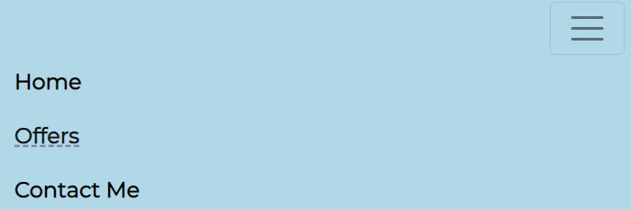
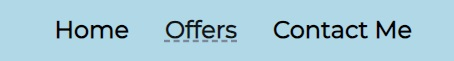
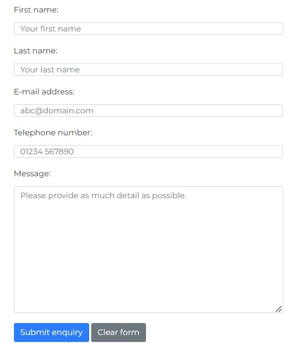

# Stuart Shimmin-Vincent - Personal Travel Agent Website

## Live project
[View the live project.](https://cshimvin.github.io/stuarts-travel-ms1/)
## Table of Contents
1. [Project Goals](#project-goals)
- Business Goals
- User Goals
2. [User Experience](#user-experience)
- User Stories
- Design and Structure
- Wireframes
3. [Features](#features)
- Must Have (current features)
- Could Have
- Won't Have (for now)
4. [Technologies Used](#technologies-used)
5. [Testing](#testing)
- HTML Validation
- CSS Validation
- Accessibility
- Performance
- Browser Compatibility
- Device Compatibility
- Testing User Stories
6. [Bugs](#bugs)
7. [Deployment](#deployment)
8. [Credits](#credits)

## Project Goals

### Business Goals

As a business, I would like the website to:
- be an online presence for the business
- to showcase what services the business offers
- be easy to navigate so visitors can find out about the company and what it offers
- to show the latest holiday offers to visitors
- to enable visitors to contact the business with any queries

### Visitor Goals

As a visitor, I would like the website to:
- be easy to navigate
- be easy to understand
- be able to view the website on a variety of devices

## User Experience

### User Stories
- First time visitor goals
    - As a first time visitor, I would like to easily find out about the company and the purpose of the site.
    - As a first time visitor, I want to be able to easily navigate the site and its content.
    - As a first time visitor, I want to be able to contact the business with any queries I have.
    - As a first time visitor, I want to be able to see what holidays are on offer.

- Returning visitor goals
    - As a returning visitor, I would like to navigate the site to find the latest holiday offers.
    - As a returning visitor, I would like to be easily able to contact the company.

- Frequent visitor goals
    - As a frequent visitor, I would like to see the latest holiday offers.

### Design and Structure

The design of the website consists of 3 separate pages which all have consistent navigation, hero image, footer and structure.

The colour of the website was decided to be light blue to convey a fresh look of a beach holiday.

The main goal of the business is to provide a personal service to find a perfect holiday for the visitor.

### Wireframes

[Wireframes of the initial design can be found in the PDF.](assets/images/documentation/wireframes.pdf)

## Features

### Current features

These are the features that have already been implemented on the website.

#### Navigation
There is a consistent navigation structure on all website pages which links to Home, Offers, and Contact pages. The current page the user is on is displayed in bold. This has 2 forms:

For smaller screens

 

For larger screens

 

#### Hero image
This shows the name of the organisation and the image conveys the colour of blue skies expected on most holidays. This is shown on every page.

The text and image also resizes on different device screens.

#### Footer

This is shown at the bottom of all pages and contains the telephone number to contact the business and links to all the social networks.

On larger screens, the contact number is on the left hand side and the social media links are on the right hand side.

On smaller screens the contact number is above the social media links.

#### Home page - introduction

This explains who the website owner is and what the site is about. It also includes a picture of the website owner to add a personal touch.

#### Home page - reasons to use the business

This section is split into 3 and explains why visitors should book holidays with the business. The 3 columns stack above each other on smaller screens.

Larger screens:

Smaller screens:

#### Offers page - offers

This page shows at least 3 of the latest offers that includes a title, image, description and a call to action to enquire about the holiday offer. These are shown side by side on larger screens and stacked above each other on smaller screens. Offer images must be of dimension 340x255 and in JPG format

On larger screens

On smaller screens

#### Contact page - contact form

The enables visitors to contact the business to enquire about booking a holiday. It asks for the visitors name, email address, telephone number and details of their enquiry.

### Features the site could have

If there was more time in this phase of the project then the following could be implemented:

- There could be more offers on the offers page (probably 6).
- There could be a form for visitors to sign up for special offers.

### Features the site won't have (for now)

In future iterations, the following possible features could be added:

- Auto-completion of the form with holiday details when clicking on the "Enquire" button on the offers.
- Additional fields could be added to the contact form asking for information such as departure dates, destinations required and budget.
- An online payment system for visitors to pay for holidays that they have booked.

## Technologies Used

- [HTML5](https://en.wikipedia.org/wiki/HTML5) to create the website.
- [CSS3](https://en.wikipedia.org/wiki/CSS3) to style the website.
- [Bootstrap 5](https://getbootstrap.com/) was used for the layout of the site.
- [FontAwesome](https://fontawesome.com/) was used to create some of the icons on the site.
- [Google Fonts](https://fonts.google.com/) was used to display the typography of the site: [Montserrat](https://fonts.google.com/specimen/Montserrat) and [REM](https://fonts.google.com/specimen/REM).
- [Code Institute Form Dump URL](https://learn.codeinstitute.net/courses/course-v1:CodeInstitute+HE101+2020/courseware/fcc67a894619420399970ae84fc4802f/ee2afa91c35e4268b7de2ea21fe311dd/) was used to make the form submit button work and to display what text would be sent to the server. This is useful for user testing.
- [Git](https://git-scm.com/) was used for version control of the code.
- [GitHub](https://github.com/) was used as a repository for the code and GitHub pages was used to host the site.

## Testing

###  User stories tests

The user stories have been tested and the results are:

| User story                                                                                   | Outcome                                                                                            | Result |
| -------------------------------------------------------------------------------------------- | -------------------------------------------------------------------------------------------------- | ------ |
| As a visitor, I would like to easily find out about the company and the purpose of the site. | As a visitor, I can understand that this is a travel website with the latest offers                | PASS   |
| As a visitor, I want to be able to easily navigate the site and its content.                 | As a visitor, I can see there is consistent navigation on each page with links that work.          | PASS   |
| As a visitor, I want to be able to contact the business with any queries I have.             | As a visitor, I can use the contact form or call them using the number on the footer of each page. | PASS   |
| As a visitor, I want to be able to see what holidays are on offer                            | As a visitor, I can see the offers page with the latest travel offers.                             | PASS   |

### Functionality

The functionality for various aspects of the site was tested and the results are:

| Feature            | Expected outcome                                                                                                                | Action                                                       | Result |
| ------------------ | ------------------------------------------------------------------------------------------------------------------------------- | ------------------------------------------------------------ | ------ |
| Navbar             | When clicked it goes to the relevant page                                                                                       | Clicked the links in the navbar on each page                 | PASS   |
| Navbar             | When the navigation elements are hovered over, the items go bold                                                                | Hovered over the navigation links on all pages               | PASS   |
| Navbar             | When the navigation menu is displayed on a small screen it changes to a hamburger menu                                          | Resized the screen to show the hamburger menu                | PASS   |
| Social media links | When clicked it goes to the relevant social media platform                                                                      | Clicked the links in the footer on each page                 | PASS   |
| Form submit button | When form is completed and submit button clicked, it submits the details                                                        | Completed the form and clicked the Submit button             | PASS   |
| Form validation    | When form fields haven't been completed the form is not submitted and an error message is displayed                             | Attempted to submit the form with form fields missing        | PASS   |
| Form validation    | When an invalid email format is entered in the email field on the form, the form won't submit and an error message is displayed | Attempted to submit the form with an incorrect email address | PASS   |
| Hero image         | The hero image will display on page load                                                                                        | Refreshed the pages                                          | PASS   |

### HTML Validation

All pages were tested using the [W3C HTML validator](https://validator.w3.org/nu/) and no errors were found. The results are in PDF documents: [index.html](assets/images/documentation/html-validation-index.pdf), [contact.html](assets/images/documentation/html-validation-contact.pdf) and [offers.html](assets/images/documentation/html-validation-offers.pdf) validation results.

### CSS Validation

The CSS stylesheet styles.css was checked using the [W3C CSS validator](https://validator.w3.org/) and no errors were found. The results can be found in the [CSS validation results PDF](assets/images/documentation/css-validation.pdf).

### Accessibility and Performance

Accessibility was checked to ensure that Aria labels and image alt text was added to all images and visual elements on the site.

Lighthouse reports were also created on desktop and mobile which passed accessibility. There were a few performance suggestions which could be implemented in future iterations.

- [Lighthouse desktop report PDF](assets/images/documentation/lighthouse-desktop.pdf)
- [Lighthouse mobile report PDF](assets/images/documentation/lighthouse-mobile.pdf)

### Browser Compatibility

The website has been tested on the following browsers:

- Google Chrome Version 115.0.5790.110 (Official Build) (64-bit)
- Mozilla Firefox Version 115.0.3 (64-bit)
- Microsoft Edge Version 115.0.1901.188 (Official build) (64-bit)

The layout and website works on all the above browsers.

### Device Compatibility

The responsiveness and layout of the site has been tested on a number of devices including tablets, desktops and mobile phones from iPhone 5 to 5K screens and the website displays correctly.

Chrome developer tools were used at various points during the development including when changes were made to the layout.

### Check links work

All links were tested manually and by using the [Broken Link Checker extension](https://chrome.google.com/webstore/detail/broken-link-checker/nibppfobembgfmejpjaaeocbogeonhch?utm_source=ext_sidebar&hl=en-US) on Google Chrome.

## Bugs

The images in the offer boxes spilled out of the box when the browser window was resized. The `max-width` property was added to the CSS selector which resolved the issue.

The reasons to book with me boxes on the homepage had text extending beyond the bottom of the boxes when resized. Media queries were added to resolve this issue.

Heading text on the hero image was not resized on smaller screens. Media queries were added to resolve this issue.

About me image on homepage had right alignment issues on Microsoft Edge when carrying out testing. A `float: right` property was added to the CSS to resolve this issue.

## Deployment

### How the site was deployed

The site was deployed using GitHub and is hosted on [GitHub Pages](https://cshimvin.github.io/stuarts-travel-ms1/) and was deployed as follows:

- Navigate to the [GitHub repository](https://github.com/cshimvin/stuarts-travel-ms1)
- Go to the **Settings** section
- Click on **Pages** on the left hand side menu
- Under Branch, select the **Master** branch then click **Save**
- After a few minutes a link to the deployed site will appear at the top of the page
- Any changes pushed to the main branch will take effect on the deployed site 

### How to clone this repository

- Go to the repository at https://github.com/cshimvin/stuarts-travel-ms1 on GitHub
- Click on the **Code** button and copy the https URL under **Clone**
- Open a terminal on GitBash
- Navigate to the folder you want to store the cloned repository
- In the terminal type `git clone` and paste the URL of the cloned repository after it then press Enter
- The site will then be cloned to that directory

## Credits

### Images
Any images not referenced are owned by the developer. Offer images obtained from pxhere.com and are Free for personal and commercial use. No attribution required.

#### Offer Images
- Cruise Ship image - https://pxhere.com/en/photo/551328
- Christmas Markets - https://pxhere.com/en/photo/1411798
- Tenerife - https://pxhere.com/en/photo/787798

### Code
- Social networks list – [Code Institute module on Bootstrap](https://learn.codeinstitute.net/courses/course-v1:codeinstitute+FE+2017_T3/courseware/616289d66b5641a3808cc43e53842695/b51f7b8b815c4bcd9979d2281b6d97a9/?child=last)
- Hamburger responsive navigation - [Code Institute module on Bootstrap](https://learn.codeinstitute.net/courses/course-v1:codeinstitute+FE+2017_T3/courseware/a4b90d17e5c94220a0f83f00ce7fa606/4b3b1b062b01424997c8fd052e177b8e/)